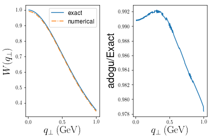
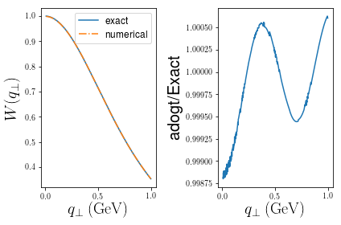

Usage
=====

The repository contains a python 2.7 library named 'AdOg.py' as well as example files 'example.py'.

Dependencies
------------

- Only Linux and OSX are supported.

- Python version relies on Numpy and Scipy libraries. We recommend to install anaconda (python2) which 
  comes will all the necessary libraries.

Installation
------------

Clone the codes from https://github.com/UCLA-TMD/Ogata.

Add the numerical package to the environmental variable PYTHONPATH by executing the following.

  PYTHONPATH=path2Ogata:$PYTHONPATH

Python Example
--------------

Here we will give an example use for adogu and adogt in python 2.7. This follows 'example.py' in the repository and is used to numerically perform the integration

.. math::
   \int_0^{\infty} db_\perp b_\perp e^{-b_\perp} J_\nu(b_\perp q_\perp).

Begin by importing all external dependencies. ::

  import numpy as np
  import pylab as py
  from  matplotlib import rc
  rc('font',**{'family':'sans-serif','sans-serif':['Helvetica']})
  rc('text',usetex=True)

Now import the adaptive quadrature class and initialize for :math:`\nu=0`. ::

   from AdOg import AdOg
   nu = 0
   adog = AdOg(nu)

Define our function. ::

   test = lambda b: b*np.exp(-b)

Set our parameters. ::

   N=10
   Q=1.0 # inverse of where test(b) peaks in bt space
   q=np.linspace(0.01,1,1000)
   nu=0

Gather data. ::

   exact = lambda qT: (1+qT**2)**(-1.5) #Known analytic Hankel transform
   wexact = [exact(_q) for _q in q]
   wadog  = [adog.adogt(test,_q,N,Q,nu) for _q in q]
   ratios = [wadog[i]/wexact[i] for i in range(len(q))]

Plot. ::

   ax=py.subplot(121)
   ax.plot(q,wexact,'-',label='exact')
   ax.plot(q,wadog,'-.',label='numerical')
   ax.set_xlabel(r'$q_{\perp}\; \rm (GeV)$',fontsize=20)
   ax.set_ylabel(r'$W(q_{\perp})$',fontsize=20)
   ax.legend(fontsize=12)
   ax=py.subplot(122)
   ax.plot(q,ratios)
   ax.set_xlabel(r'$q_{\perp}\; \rm (GeV)$',fontsize=20)
   ax.set_ylabel('Numerical/Exact',fontsize=20)
   py.tight_layout()
   py.show()

Doing the same for adogt, we have ::

   wadogt  = [adog.adogt(test,_q,N,Q,nu) for _q in q]
   ratios = [wadogt[i]/wexact[i] for i in range(len(q))]
   ax=py.subplot(121)
   ax.plot(q,wexact,'-',label='exact')
   ax.plot(q,wadogt,'-.',label='numerical')
   ax.set_xlabel(r'$q_{\perp}\; \rm (GeV)$',fontsize=20)
   ax.set_ylabel(r'$W(q_{\perp})$',fontsize=20)
   ax.legend(fontsize=12)
   ax=py.subplot(122)
   ax.plot(q,ratios)
   ax.set_xlabel(r'$q_{\perp}\; \rm (GeV)$',fontsize=20)
   ax.set_ylabel('adogt/Exact',fontsize=20)
   py.tight_layout()
   py.show()

