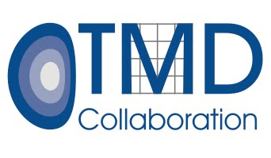

.. Ogata-TMD documentation master file, created by
   sphinx-quickstart on Tue Apr 16 14:17:54 2019.

Ogata-TMD
=========

Ogata-TMD package for performing fast Hankel transforms for applications to TMDs.

.. toctree::
   :maxdepth: 2
   :caption: Contents:
   
   Installation
   Publication
   License
   Help

.. Indices and tables
   ==================

   * :ref:`genindex`
   * :ref:`modindex`
   * :ref:`search`

Authors
=======

- John Terry (UCLA)
- Zhongbo Kang (UCLA)
- Nobuo Sato (UConn) 
- Alexei Prokudin (PSU) 

